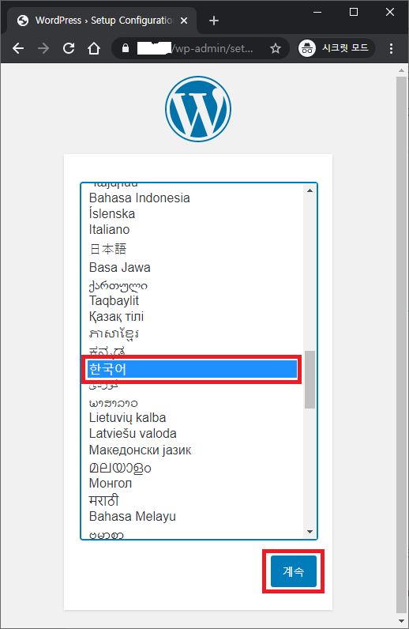
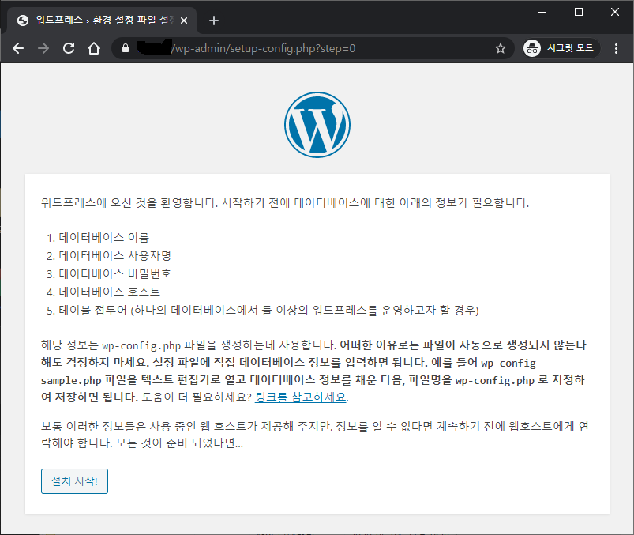
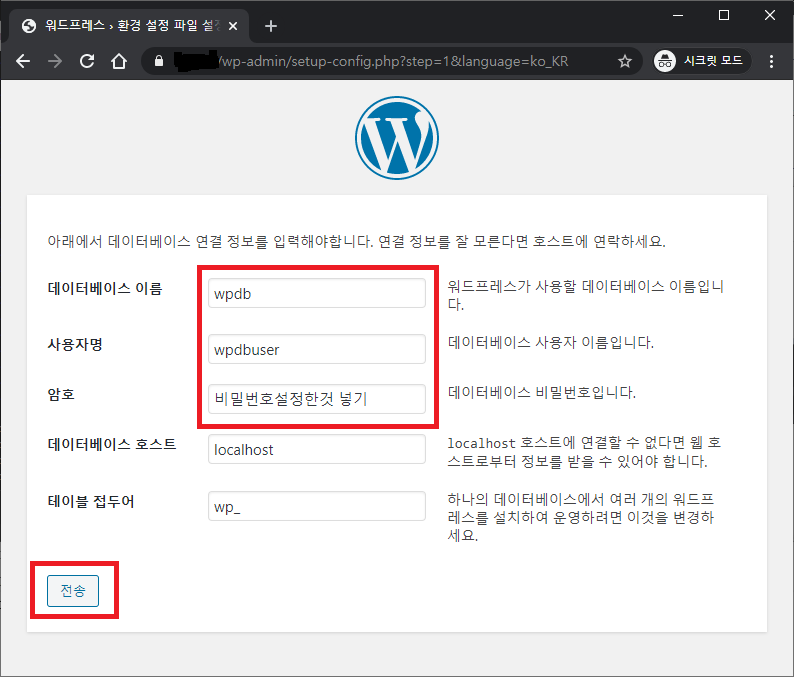
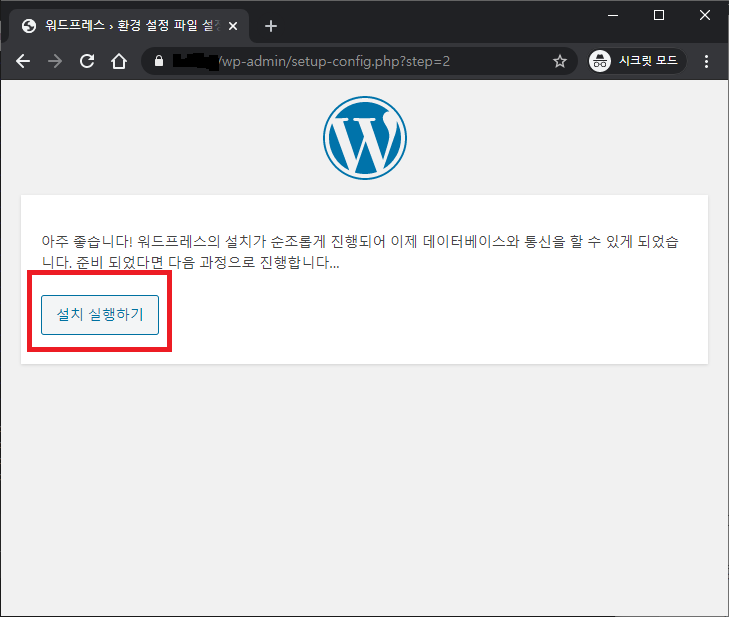
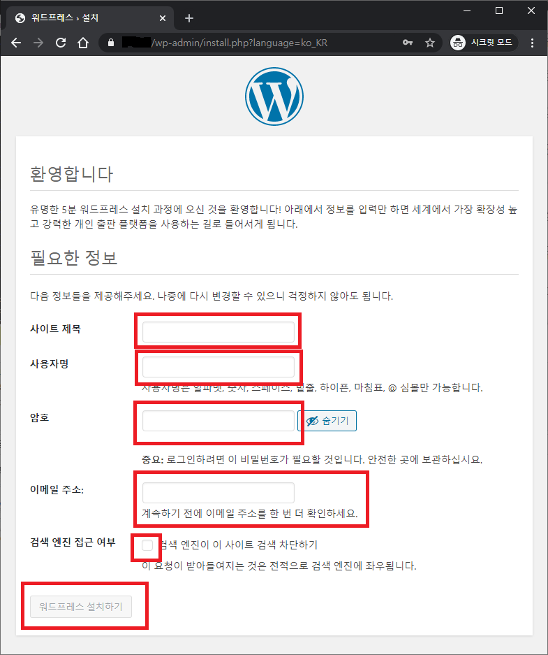
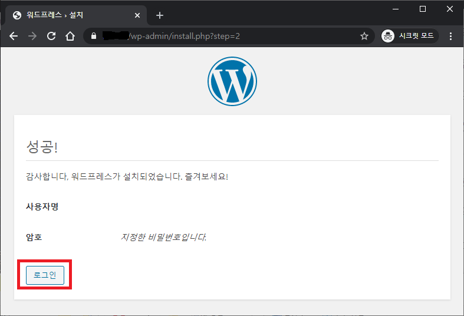
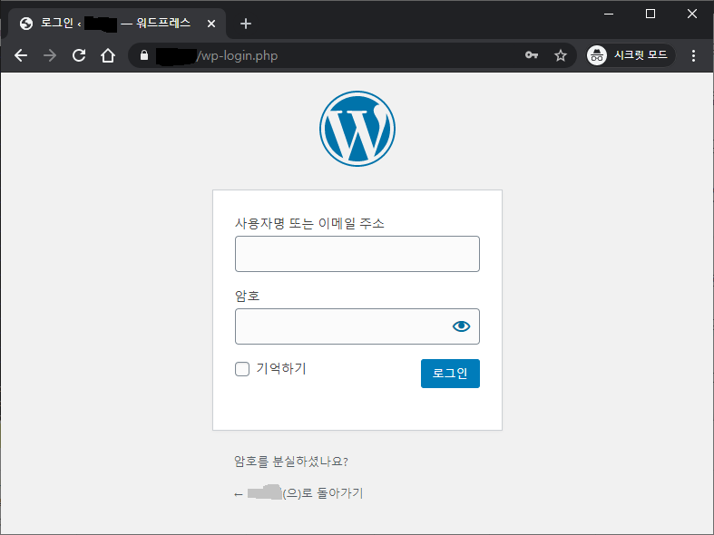
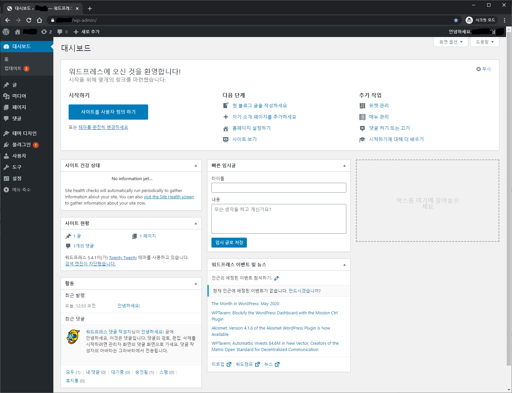

무료 홈페이지 주소 받기

<a href="https://blog.wsgvet.com/free-homepage-address-freenom" target="_blank" rel="noopener noreferrer">https://blog.wsgvet.com/free-homepage-address-freenom</a>

---

클라우드 플레어 가입 및 네임서버 변경하기

<a href="https://blog.wsgvet.com/cloudflare-sign-in-and-change-nameserver" target="_blank" rel="noopener noreferrer">https://blog.wsgvet.com/cloudflare-sign-in-and-change-nameserver</a>

---

구글 클라우드 플랫폼 가입, 도메인 연결, Nginx 설치

<a href="https://blog.wsgvet.com//sign-in-google-cloud-platform-and-connect-domain-and-hello-world" target="_blank" rel="noopener noreferrer">https://blog.wsgvet.com//sign-in-google-cloud-platform-and-connect-domain-and-hello-world</a>

---

구글 클라우드 컴퓨트 엔진에서 우분투 기본 설정하기

<a href="https://blog.wsgvet.com/google-cloud-compute-engine-ubuntu-basic-setting" target="_blank" rel="noopener noreferrer">https://blog.wsgvet.com/google-cloud-compute-engine-ubuntu-basic-setting</a>

---

letsencrypt 와일드카드 인증서 발급 및 MariaDB 설치하기

<a href="https://blog.wsgvet.com/letsencrypt-wildcard-certification-issue-and-mariadb-install" target="_blank" rel="noopener noreferrer">https://blog.wsgvet.com/letsencrypt-wildcard-certification-issue-and-mariadb-install</a>

---

위 5개 글에 따라 따라오셨다면 이제 이 글을 보시면 됩니다.

구글 클라우드 무료 티어에서도 생각보다 빠릿하게 돌아가더라구요!

---

## php7.4 패키지 설치 및 기본설정하기

    sudo apt update && sudo apt upgrade
    

위 명령어로 현재 패키지 리스트 업데이트 및 최신 패키지를 설치합니다.

    sudo apt install php7.4-fpm php7.4-common php7.4-mysql php7.4-gmp php7.4-curl php7.4-intl php7.4-mbstring php7.4-xmlrpc php7.4-gd php7.4-xml php7.4-cli php7.4-zip zip unzip
    

위 명령어로 워드프레스에 필요한 패키지를 설치합니다.

    sudo nano /etc/php/7.4/fpm/php.ini
    

위 명령어로 들어가면 엄청나게 많은 글의 내용이 나오는데요.

    short_open_tag = On
    memory_limit = 256M
    cgi.fix_pathinfo = 0
    upload_max_filesize = 100M
    post_max_size = 101M
    max_execution_time = 360
    date.timezone = Asia/Seoul
    

위 항목을 찾아서 다 바꿔줍니다.

찾는 방법은 컨트롤 + W 누르면 밑에 검색창이 나오는데, 앞부분을 복사해서 붙여넣고 엔터를 치면 찾아집니다.

예를들어 short_open_tag를 바꾸고 싶다면 short_open_tag 를 넣고 엔터를 치면 해당부분으로 갑니다.

참고로 short_open_tag는 처음 검색하면 설명 부분이 나오는데 한번더 검색하면 제대로 나옵니다.

cgi.fix_pathinfo는 아마도 " ;cgi.fix_pathinfo = 1 " 이렇게 되어있을텐데요. 앞에 ; 은 주석으로 처리한다는 뜻이므로 이것도 빼야겠죠.

즉 ;cgi.fix_pathinfo = 1 을 cgi.fix_pathinfo = 0  이렇게 바꿔줘야 하는 것입니다.

그 뒤에 수정하면 됩니다. 전부 찾아서 다 바꾼 후

컨트롤 + O, 엔터, 컨트롤 + X를 누르면 저장 후 빠져나와집니다.

    sudo systemctl reload php7.4-fpm
    

위 명령어로 설정을 적용해줍니다.

---

## MariaDB에서 DB 생성하기

    sudo mysql -u root -p
    

위 명령어로 MariaDB로 들어갑니다.

    CREATE DATABASE wpdb;
    

위 명령어로 wpdb라는 DB를 만듭니다.

    CREATE USER 'wpdbuser'@'localhost' IDENTIFIED BY 'password';
    

위 명령어로 wpdbuser라는 MariaDB의 유저를 생성하고 그 비밀번호를 password로 합니다.

**password를 꼭 자신에게 맞는 비번으로 바꾸세요! 이 비번은 DB입력할때 꼭 필요한 비번입니다.**

    GRANT ALL ON wpdb.* TO 'wpdbuser'@'localhost' WITH GRANT OPTION;
    

위 명령어로 wpdbuser유저가 wpdb라는 DB의 모든 권한을 가지게 됩니다.

    FLUSH PRIVILEGES;
    EXIT;
    

저장 후 빠져나옵니다.

---

## 워드프레스 최신판 설치하기

    cd /tmp
    wget https://wordpress.org/latest.tar.gz
    tar -xvzf latest.tar.gz
    sudo mv wordpress /var/www/wordpress
    

위 4개의 명령어로 워드프레스 최신판을 다운로드하고, 압축을 풀고, /var/www/wordpress에 위치하게 합니다.

    sudo chown -R www-data:www-data /var/www/wordpress/
    sudo chmod -R 755 /var/www/wordpress/
    

위 두 명령어로 해당 폴더의 소유권을 www-data에게 주고, 권한을 755로 줍니다.

---

## Nginx 설정파일 만들기

(1) 워드프레스 전용 rewirte 설정파일 만들어주기

    sudo nano /etc/nginx/snippets/wp-conf.conf
    

위 명령어로 설정파일 만들기에 들어갑니다.

    charset utf-8;
    server_tokens off;
    client_max_body_size 100M;
    autoindex off;
    
    location ~ \.(gif|jpg|png)$ {
    	add_header Vary "Accept-Encoding";
    	add_header Cache-Control "public, no-transform";
    	expires max;
    	}
    location ~* \.(mp4|css|js)$ {
    	expires max;
    	log_not_found off;
                }
    location ~*.(ogg|ogv|svg|svgz|eot|otf|woff|woff2|ttf|rss|atom|ico|zip|tgz|gz|rar|bz2|doc|xls|exe|ppt|tar|mid|midi|wav|bmp|rtf|cur)$ {
    	expires max;
    	log_not_found off;
    	access_log off;
    	}
    location / {
    	try_files $uri $uri/ /index.php?$args;
    	}
    location ~ /\.ht {
    	deny all;
    	}
    location ~ \.php$ {
    	include snippets/fastcgi-php.conf;
    	fastcgi_pass unix:/var/run/php/php7.4-fpm.sock;
    	fastcgi_param SCRIPT_FILENAME $document_root$fastcgi_script_name;
    	include fastcgi_params;
    	}    
    

위 내용을 그대로 복사 후 붙여넣기 해줍니다.

컨트롤 + O, 엔터, 컨트롤 + X 엔터를 누르면 저장 후 빠져나옵니다.

---

(2) SSL 관련 설정파일 만들기

    sudo nano /etc/nginx/snippets/wp-ssl.conf
    

위 명령어로 SSL 설정파일 만들기에 들어갑니다.

    ssl_certificate /etc/letsencrypt/live/yoursitename/fullchain.pem; # 이 경로도 인증서 만들때 중요했던, 그 경로로 바꾸세요.
    ssl_certificate_key /etc/letsencrypt/live/yoursitename/privkey.pem; # 이 경로도 인증서 만들때 중요했던, 그 경로로 바꾸세요.
    ssl_trusted_certificate /etc/letsencrypt/live/yoursitename/chain.pem;  # 이 경로도 인증서 만들때 중요했던, 그 경로로 바꾸세요.
    
    ssl_dhparam snippets/dhparams.pem;
    ssl_session_cache shared:SSL:10m;
    ssl_session_timeout 1d;
    ssl_session_tickets off;
    
    ssl_ecdh_curve X25519:sect571r1:secp521r1:secp384r1;
    ssl_stapling on;
    ssl_stapling_verify on;
    resolver 8.8.8.8 8.8.4.4 valid=300s;
    resolver_timeout 10s;
    
    ssl_protocols TLSv1.2 TLSv1.3;
    ssl_prefer_server_ciphers off;
    ssl_ciphers ECDHE-ECDSA-AES128-GCM-SHA256:ECDHE-RSA-AES128-GCM-SHA256:ECDHE-ECDSA-AES256-GCM-SHA384:ECDHE-RSA-AES256-GCM-SHA384:ECDHE-ECDSA-CHACHA20-POLY1305:ECDHE-RSA-CHACHA20-POLY1305:DHE-RSA-AES128-GCM-SHA256:DHE-RSA-AES256-GCM-SHA384;
    
    add_header X-Frame-Options SAMEORIGIN;
    add_header X-Content-Type-Options nosniff;
    add_header X-XSS-Protection "1; mode=block";     
    add_header Strict-Transport-Security "max-age=31536000; includeSubDomains; preload";
    

위 내용을 메모장에 복사 후 **수정**한 뒤에 붙여넣기 해줍니다.

제일 위에 인증서 경로를 꼭 수정해주세요! 

보통 자신의 홈페이지 주소를 넣으면 됩니다.

예를들어 홈페이지 주소가 abc.com  이면

ssl_certificate /etc/letsencrypt/live/yoursitename/fullchain.pem;

위 내용에서 yoursitename을 abc.com으로 바꿔서

ssl_certificate /etc/letsencrypt/live/abc.com/fullchain.pem;

위와 같이 바꾸면 됩니다.

다 바꾼 후 컨트롤 + O, 엔터, 컨트롤 + X 엔터를 누르면 저장 후 빠져나옵니다.

---

(3) dhparams.pem 생성하기

    sudo openssl dhparam -out /etc/nginx/snippets/dhparams.pem 2048
    

위 명령어로 dhparams.pem 파일을 생성합니다.

대략 10~20초면 생성이 됩니다.

---

(4) 서버 설정파일 만들기

    sudo nano /etc/nginx/sites-available/wordpress
    

위 명령어로 설정파일로 들어갑니다.

    server {
        listen 80;
        server_name example.com www.example.com;
        location / {
            rewrite       ^/(.*)$ https://example.com/$1 permanent;
        }
    }
    
    server {
    listen 443 ssl http2;
    listen [::]:443 ssl http2;
    
    index index.html index.php;
    
    access_log off;
    
    server_name example.com www.example.com;
    if ($host != 'example.com' ) {
    rewrite ^/(.*)$  https://example.com/$1 permanent;
    }
     
    root /var/www/wordpress;
    index index.php;
    
    include snippets/wp-conf.conf;
    include snippets/wp-ssl.conf;
    }
    

위 내용을 **그대로 붙이지 말고**, 메모장에 붙여넣기 한 뒤에 example.com 을 자신의 홈페이지 주소로 바꿔야 됩니다.

다 바꾼 후 붙여넣습니다. 그 뒤에 컨트롤 + O, 엔터, 컨트롤 + X 엔터를 누르면 저장 후 빠져나옵니다.

    sudo ln -s /etc/nginx/sites-available/wordpress /etc/nginx/sites-enabled/
    

위 명령어로 설정파일을 활성화되게 해줍니다.

    sudo rm -f /etc/nginx/sites-enabled/default
    

위 명령어로 기존 활성화된 default 서버 링크만 삭제해줍니다.

    sudo nginx -t
    

위 명령어로 설정에 이상이 없는지 확인합니다.

    nginx: the configuration file /etc/nginx/nginx.conf syntax is ok
    nginx: configuration file /etc/nginx/nginx.conf test is successful
    

위 내용이 나온다면 성공한 것입니다.

    sudo service nginx restart
    

위 명령어로 nginx를 재시작해줍니다.

이제 서버쪽 설정은 모두 끝났습니다!

---

## 워드프레스 접속 및 초기 설정하기

이제 주소창에 설정한 주소 를 넣어보세요.

위와 같이 언어설정부터 나옵니다.

한국어를 선택 후 계속을 눌러주세요.

설치시작!을 누르세요

위와 같이 아까 DB 만들었던 그 내용을 넣으면 됩니다.

데이터베이스 이름에 wpdb 를 넣고

사용자명에 wpdbuser 를 넣고

암호는 password 대신에 넣었던 자신의 비번을 넣으면 됩니다.

데이터베이스 호스트와 테이블 접두어는 그대로 두고 전송을 누릅니다.

설치 실행하기를 누릅니다.

사이트 제목은 원하는 이름을 넣으면 됩니다.

사용자명은 접속 ID입니다.

암호는 원하는대로 넣으시고

이메일 주소도 자신의 주소를 넣으면 됩니다.

나중에 바꿀때 인증 메일을 받을 수 있게 실제 사용하는 이메일을 넣는게 좋겠죠

그리고 검색 엔진 접근 여부는 이 사이트에 검색 엔진이 들어와서 검색에 걸리도록 할지 말지 결정하는 것입니다.

그리고 다  되었다면 워드프레스 설치하기를 누르세요.

이제 성공!이 떴습니다. 자신의 아이디가 나오고 로그인을 누르세요

사용자명에 아이디를 넣고 암호에 비번을 넣고 로그인을 합니다.

드디어 메인 관리자 페이지가 떴습니다!  고생하셨어요!!!

---

참조사이트

How to Install WordPress on Ubuntu 20.04 | 18.04 with Nginx and Let’s Encrypt | Website for Students

<a href="https://websiteforstudents.com/how-to-install-wordpress-on-ubuntu-20-04-18-04-with-nginx-and-lets-encrypt" target="_blank" rel="noopener noreferrer">https://websiteforstudents.com/how-to-install-wordpress-on-ubuntu-20-04-18-04-with-nginx-and-lets-encrypt</a>
